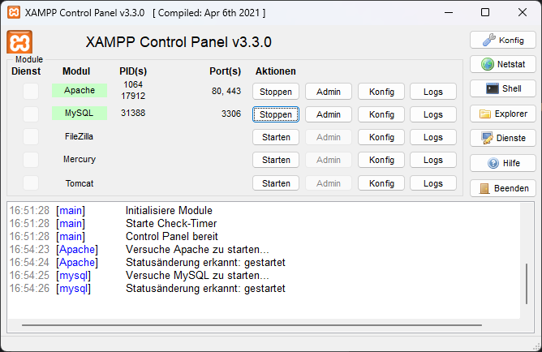
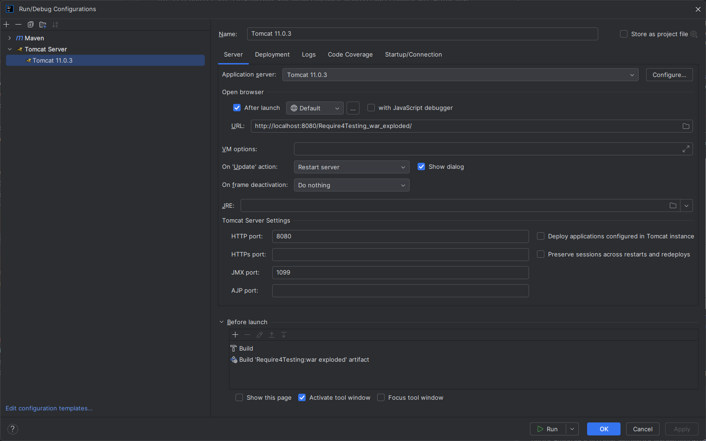

# Require4Testing Startup Projekt

Require4Testing ist eine JSF-Anwendung, die dafür da ist manuelle Anwendertests
zu erstellen, zu verwalten und zu organisieren. Dabei gibt es 4 verschiedene Benutzergruppen,
die jeweils einen genauen Aufgabenbereich haben und verschiedene Anwendungsfälle dieser Webapp abdecken.

## Inhaltsverzeichnis
<!-- TOC -->
  * [Entwicklung](#entwicklung)
    * [Voraussetzungen](#voraussetzungen)
    * [Die wichtigsten Bibliotheken](#die-wichtigsten-bibliotheken)
    * [Einrichtung der Datenbankanbindung](#einrichtung-der-datenbankanbindung-in-xampp)
    * [Das Projekt bauen](#das-projekt-bauen)
    * [Projekt lokal starten](#projekt-lokal-starten)
<!-- TOC -->

## Entwicklung

### Voraussetzungen

Dieser Abschnitt listet die Mittel auf, die benötigt werden, damit die Applikation funktioniert:

- Eine IDE (beispielsweise IntelliJ) <https://www.jetbrains.com/de-de/idea/download/?section=windows#section=windows>
- Java 17+
- Einen lokalen Tomcat Server **(Version 11)** <https://tomcat.apache.org/download-11.cgi>
  - Die Systemumgebungsvariable "CATALINA_HOME" und "JAVA_HOME" müssen entsprechend gesetzt sein
- XAMPP um die Datenbank lokal zu starten <https://www.apachefriends.org/de/download.html>

### Die wichtigsten Bibliotheken

**Jakarta Servlet API**

Diese Bibliothek stellt die grundlegende Unterstützung für Servlets bereit, 
die zur Verarbeitung von HTTP-Anfragen und -Antworten in Webanwendungen verwendet werden. 
Sie ist essenziell für die Implementierung von Java-basierten Webanwendungen, die auf einem Servlet-Container wie Tomcat laufen.

**Jakarta Faces:**

Jakarta Faces ist ein Framework für die Entwicklung komponentenbasierter Benutzeroberflächen für Webanwendungen. 
Es ermöglicht die einfache Verwaltung von UI-Komponenten und deren Zustand während der gesamten Lebensdauer einer Webanwendung.

**Jakarta CDI**

Contexts and Dependency Injection (CDI) bietet eine leistungsstarke Abhängigkeitsverwaltung für Java-EE- und Jakarta-EE-Anwendungen. 
Diese API erleichtert die lose Kopplung von Komponenten und fördert eine modulare Anwendungsarchitektur.

**Jakarta EJB API**

Diese API unterstützt Enterprise JavaBeans (EJB), die zur Implementierung von transaktionalen, verteilten und sicherheitskritischen Unternehmensanwendungen verwendet werden. 
EJBs helfen, Geschäftslogik wiederverwendbar und skalierbar zu machen.

**Weld Servlet Core**

Weld ist die Referenzimplementierung für Jakarta CDI und ermöglicht die Nutzung von Dependency Injection in servletbasierten Anwendungen. 
Es verbessert die Testbarkeit und Wartbarkeit von Webanwendungen durch eine flexible und modulare Architektur.

**PrimeFaces**

PrimeFaces ist eine UI-Komponentenbibliothek für JSF, die eine Vielzahl von modernen, responsiven und interaktiven UI-Elementen bereitstellt. 
Sie erleichtert die Entwicklung von ansprechenden Benutzeroberflächen mit wenig JavaScript und CSS.

**jBCrypt**

Diese Bibliothek bietet eine sichere Möglichkeit zur Passwort-Hashing und -Speicherung in Java-Anwendungen. 
Sie verwendet den BCrypt-Algorithmus, der besonders widerstandsfähig gegen Brute-Force- und Rainbow-Table-Angriffe ist.

**MySQL Connector**

Diese Bibliothek stellt die JDBC-Schnittstelle für MySQL-Datenbanken bereit und ermöglicht Java-Anwendungen den Zugriff auf MySQL-Datenbanken. 
Sie ist notwendig, um Datenbankoperationen in einer Java-EE- oder Jakarta-EE-Anwendung auszuführen.

**Hibernate Core**

Hibernate ist ein ORM (Object-Relational Mapping) Framework, das die Verwaltung von Datenbankzugriffen in Java vereinfacht. 
Es reduziert den Aufwand für SQL-Abfragen und bietet eine transparente Persistenzschicht für relationale Datenbanken.

**Hibernate Validator**

Diese Bibliothek ist die Referenzimplementierung der Bean Validation API (Jakarta Validation) 
und ermöglicht das Validieren von Java-Objekten basierend auf Annotationen.

### Einrichtung der Datenbankanbindung in XAMPP

Nach der erfolgreichen Installation von XAMPP muss dieses über den Control Panel gestartet werden.
Starte im Control Panel die Instanzen Apache und MySQL wie im Bild zu sehen:

Über den Admin in MySQL erreicht man das Datenbankmanagementsystem, wo die Datenbank abgelegt werden soll.
Erstelle nun eine neue Datenbank mit dem Namen "require4Testing", damit später die Datenbankoperationen darauf verweisen.
### Das Projekt bauen

Das Projekt wird über Maven gebaut.
Führe dementsprechend folgenden Befehl aus:
```shell
mvn clean install
```

### Projekt lokal starten

Um das Projekt lokal zu starten, wird nun das gebaute Artefakt und der Tomcat Server benötigt.

In IntelliJ: Erstelle eine neue Run Konfiguration, die einen lokalen Tomcat Server starten soll.
Die Konfiguration soll in etwa so aussehen:


Starte nun den Tomcat Server über die eben eingestellte Konfiguration.
Wirst du automatisch zur Loginseite der Applikation weitergeleitet?

Super! Die Applikation wurde erfolgreich lokal gestartet!